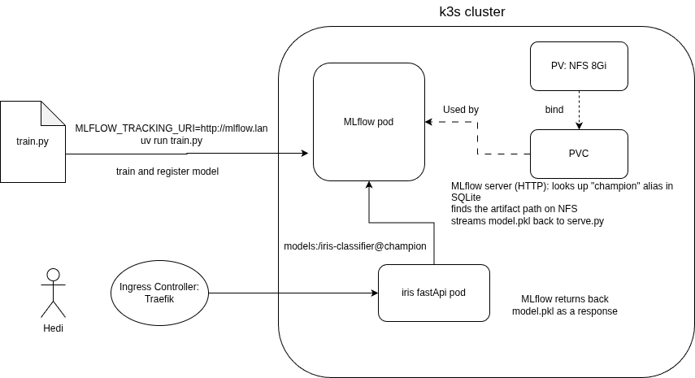
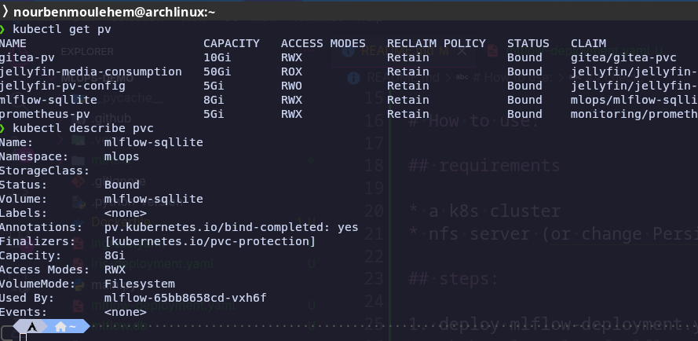
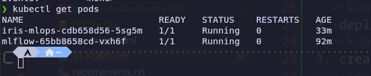
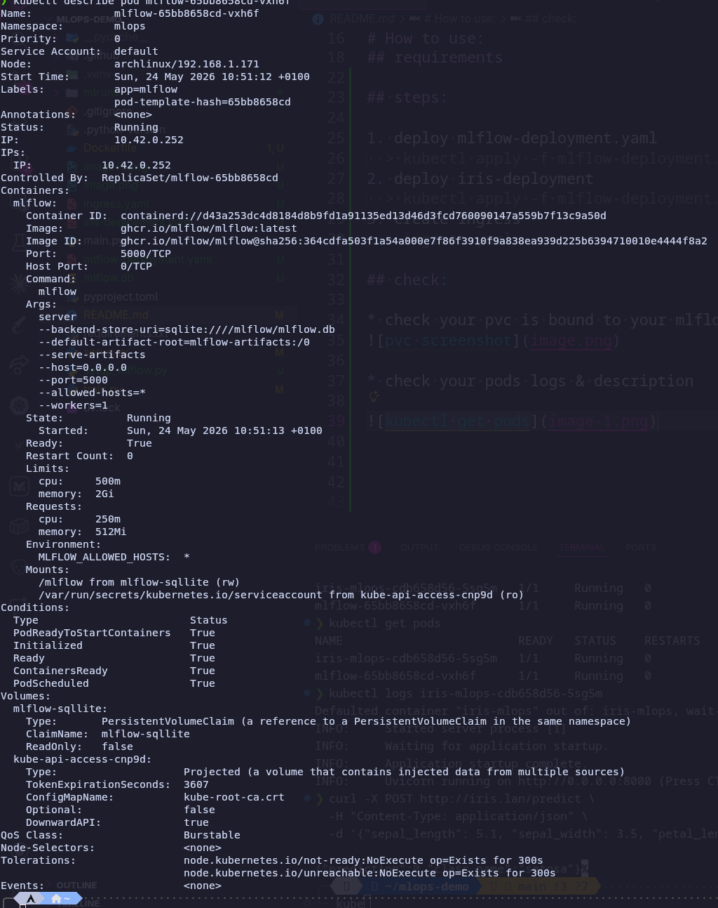
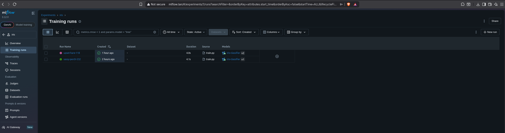
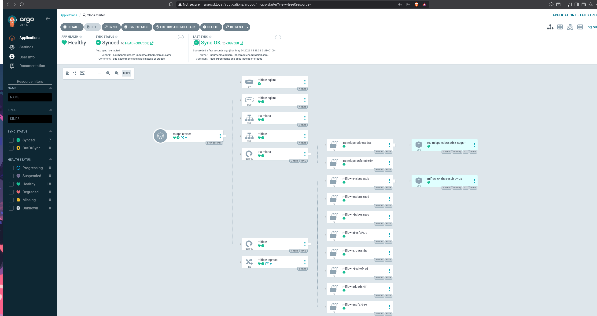
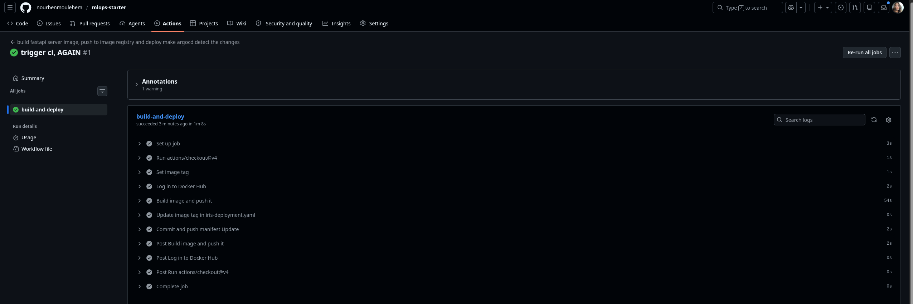
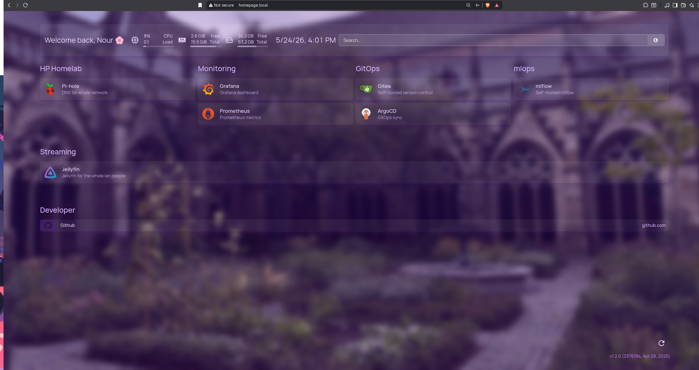

# MLOPS - starter

It all started with me being curious and getting serious about MLOps, what is it, and how does it differ from DevOps?

MLOps sounded cool, really, but how does it work?

And here's where I discovered MLflow, a tool that links training to serving through a registry.

I went a little further and deployed MLflow and FastAPI to make it accessible on my LAN network, so why not ? my family could use this endpoint to classify iris flowers.


# Architecture



Training happens outside the cluster, train.py pushes to MLflow over HTTP. Inside the cluster, FastAPI loads the champion (production) model from MLflow.

# Prerequisites

* a running k8s cluster (this was built on k3s with Traefik as ingress controller)
* an NFS server — the MLflow pod uses it to persist the SQLite database and model artifacts
* `kubectl` configured to talk to your cluster
* `uv` to run Python scripts locally (`train.py`, `setup_mlflow.py`)
* a DNS entry or `/etc/hosts` record pointing `mlflow.lan` to your ingress IP

# How to run it

## 1. Docker — build the FastAPI serving image

```bash
docker build -t username/iris-mlops:latest .
docker push username/iris-mlops:latest
```

## 2. Kubernetes — deploy everything

```bash
kubectl create namespace mlops
kubectl apply -f mlflow-deployment.yaml
kubectl apply -f iris-deployment.yaml
kubectl apply -f ingress.yaml
```

## 3. MLflow — one-time setup then train

Run once on a fresh MLflow instance to create the experiment:

```bash
MLFLOW_TRACKING_URI=http://mlflow.lan uv run setup_mlflow.py
```

This writes one row into the SQLite database: `name=iris, artifact_location=mlflow-artifacts:/iris`.

Then train and register the model:

```bash
MLFLOW_TRACKING_URI=http://mlflow.lan uv run train.py
```

## 4. Verify

Check your PVC is bound and pods are running:

```bash
kubectl get pvc -n mlops
kubectl get pods -n mlops
kubectl describe pod -n mlops <pod-name>
```







# 5. ArgoCd



ArgoCD was straightforward to set up. I created one Application manifest pointing at this repo, and from that point on every git push syncs the cluster automatically. One challenge, I might change :latest in iris-deployment.yaml into versioned tags so argocd would detect change and re-deploy automatically for now a manual rollout after push.

Update: I did it, check the next section.


# 6. Github Action ci pipeline

I added a github ci pipeline that is triggered on every push that touches Dockerfile or serve.py.
The pipeline builds the image tagged with the git commit SHA and pushes it to Dockerhub (my account), and then updates the iris-deployment.yaml manifest file with `sed` command to change the image tag, this would trigger argocd to redoply the pod automatically. 

to get the SHA run `git rev-parse --short HEAD`

Github actions is the CI and ArgoCD is the CD, One repo as source of truth for both, COOL. 



## 5. Test

```bash
curl -X POST http://iris.lan/predict \
  -H "Content-Type: application/json" \
  -d '{"sepal_length": 5.1, "sepal_width": 3.5, "petal_length": 1.4, "petal_width": 0.2}'
```

# HomePage
I added an entry to mlflow in my homepage



# Tools used

- **MLflow** : experiment tracking, model registry, artifact serving
- **FastAPI** : prediction API
- **scikit-learn** : RandomForest model training
- **Docker** : containerize the FastAPI serving app
- **k3s** : lightweight Kubernetes cluster (Arch Linux homelab)
- **Traefik** : ingress controller (built into k3s)
- **NFS** : persistent storage for MLflow database and artifacts
- **uv** : Python package and project manager
- **ArgoCD** : GitOps CD — watches the repo and syncs the cluster on every manifest change
- **GitHub Actions** : CI pipeline — builds and pushes the image, updates the manifest tag to trigger ArgoCD


# Final words

This project taught me that MLOps is not about fancy tools — it's about decoupling. Training and serving never talk to each other directly. The registry is the contract between them. Change the model, promote a new version, and the serving side picks it up without redeploying.

But decoupling alone is not enough. A model that works on a laptop breaks the moment it hits real traffic — without automated pipelines, containerization, and observable infrastructure, there is no bridge between a prototype and something production-ready.


